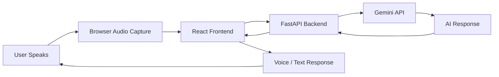
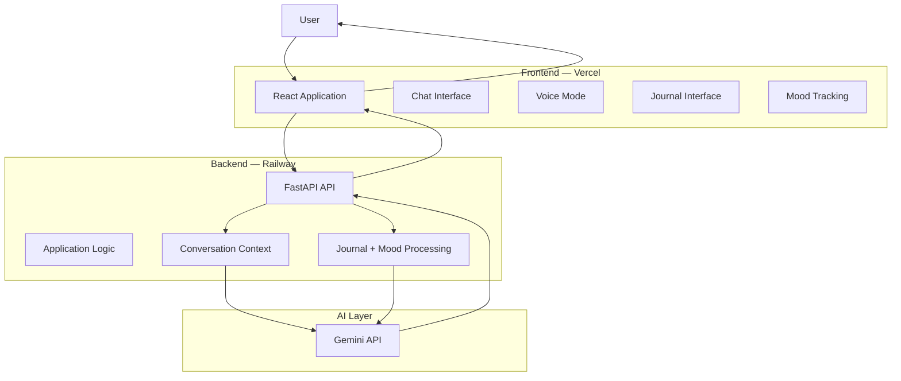
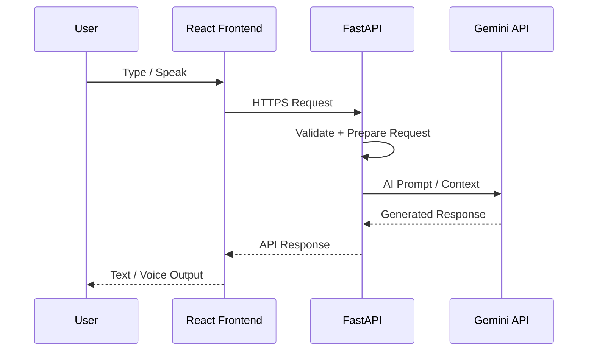

<div align="center">

# 🧠 MindSphere

### An AI companion for text, voice, journaling, and mood tracking.

[](https://mindsphere.fit)
[](https://vercel.com)
[](https://railway.app)
[](https://ai.google.dev)
[](https://fastapi.tiangolo.com/)
[](https://react.dev)
[](LICENSE)

**[🚀 Try MindSphere Live →](https://mindsphere.fit)**

</div>

---

# 🌟 Overview

**MindSphere** is a full-stack AI-powered mental wellness companion designed to make emotional reflection and self-expression more accessible.

The platform combines:

* 🎙️ Real-time voice interaction
* 💬 AI-powered conversations
* 📓 Guided journaling
* 📊 Mood tracking
* 🧠 Context-aware responses
* 📱 Responsive web experience

Instead of building a collection of disconnected AI features, MindSphere brings them together into one cohesive experience.

> **Talk. Track. Reflect.**

---

# 💡 The Problem

Many people find it difficult to consistently reflect on how they feel.

Traditional approaches can introduce friction:

```text
Feeling overwhelmed
       ↓
Need to express it
       ↓
Open journal / find someone / schedule appointment
       ↓
Friction
       ↓
Reflection gets delayed or skipped
```

MindSphere explores a lower-friction alternative:

```text
Feeling something
       ↓
Open MindSphere
       ↓
Talk / Type / Journal
       ↓
AI-assisted reflection
       ↓
Track patterns over time
```

The goal is not to replace therapists or professional care, but to create an accessible **AI-assisted reflection and wellness tool**.

---

# ✨ Core Features

| Feature                        | Description                                                                                       |
| ------------------------------ | ------------------------------------------------------------------------------------------------- |
| 🎙️ **Voice Mode**             | Speak naturally and receive AI-generated responses through a voice-first experience.              |
| 💬 **AI Chat**                 | Context-aware conversations designed around supportive and reflective interactions.               |
| 📓 **Smart Journaling**        | AI-guided prompts help users move beyond a blank journal page.                                    |
| 📊 **Mood Tracking**           | Record moods and visualize emotional patterns over time.                                          |
| 🧠 **Context Awareness**       | Uses conversation context to make interactions more coherent and personalized.                    |
| 📱 **Responsive UI**           | Designed for a clean, calm experience across desktop and mobile devices.                          |
| 🔒 **Privacy-Oriented Design** | Sensitive user information is treated as data requiring careful handling and secure architecture. |

---

# 🎙️ Voice AI Architecture

One of the main engineering challenges was creating a natural voice interaction workflow without stitching together multiple speech vendors.

MindSphere uses the **Gemini API** as the core AI service.



### Voice Pipeline

```text
User Voice
    ↓
Browser Capture
    ↓
React Frontend
    ↓
HTTPS Request
    ↓
FastAPI Backend
    ↓
Gemini API
    ↓
AI Response
    ↓
Frontend
    ↓
Spoken / Text Response
```

This architecture keeps the Gemini API key on the **backend** instead of exposing it to the browser.

---

# 🏗️ System Architecture



---

# 🌐 Production Architecture

MindSphere uses a split frontend/backend deployment model.

```text
                    ┌──────────────────┐
                    │   mindsphere.fit │
                    └────────┬─────────┘
                             │
                             ▼
                    ┌──────────────────┐
                    │ Vercel Frontend  │
                    │      React       │
                    └────────┬─────────┘
                             │
                       HTTPS / API
                             │
                             ▼
                    ┌──────────────────┐
                    │ Railway Backend  │
                    │     FastAPI      │
                    └────────┬─────────┘
                             │
                             ▼
                    ┌──────────────────┐
                    │   Gemini API     │
                    │   AI Services    │
                    └──────────────────┘
```

### Deployment

| Component | Technology       | Platform   |
| --------- | ---------------- | ---------- |
| Frontend  | React            | Vercel     |
| Backend   | Python + FastAPI | Railway    |
| AI        | Gemini API       | Google     |
| Domain    | `mindsphere.fit` | Production |

---

# 🧭 Request Lifecycle



---

# 🧠 AI Interaction Design

MindSphere is designed around the idea that AI should be more than a simple question-answering interface.

The application combines:

```text
User Input
    │
    ├── Text
    │
    ├── Voice
    │
    ├── Journal Entry
    │
    └── Mood Data
          ↓
    Context Processing
          ↓
      Gemini API
          ↓
   AI-Generated Output
          ↓
   User Reflection
```

This allows multiple features to reinforce the same overall user experience.

---

# 📓 Smart Journaling

Instead of asking users to stare at a blank page, MindSphere can use AI-generated prompts to encourage deeper reflection.

```text
User opens Journal
       ↓
AI-generated prompt
       ↓
User writes reflection
       ↓
Entry processed / stored
       ↓
Future reflection
```

Example prompt categories could include:

* Daily reflection
* Gratitude
* Challenges
* Personal goals
* Emotional awareness
* Self-reflection

---

# 📊 Mood Tracking

Users can record their mood over time and use the accumulated information to identify patterns.

```text
Daily Mood
    ↓
Mood History
    ↓
Timeline
    ↓
Pattern Recognition
    ↓
Personal Reflection
```

Future versions can extend this into weekly or monthly AI-generated summaries.

---

# 🔐 Privacy & Security

Because MindSphere can process sensitive personal information, privacy is a core engineering consideration.

Production deployments should consider:

* HTTPS communication
* Backend-only API keys
* Authentication
* Secure session management
* Encryption at rest
* Data minimization
* User-controlled deletion
* Data retention policies
* Access controls
* Secure logging
* Rate limiting
* Prompt injection protection

### API Key Architecture

```text
❌ Browser
   ↓
   Gemini API Key

✅ Browser
   ↓
   FastAPI Backend
   ↓
   Secure Environment Variable
   ↓
   Gemini API
```

The Gemini API credential should **never be shipped to the client-side application**.

---

# 🛠️ Technology Stack

### Frontend

* **React**
* JavaScript
* Responsive UI
* Browser audio APIs

### Backend

* **Python**
* **FastAPI**
* REST API architecture
* HTTPS communication

### AI

* **Gemini API**
* Conversational AI
* Voice interaction
* Prompt engineering
* Context-aware generation

### Deployment

* **Vercel** — Frontend
* **Railway** — Backend
* Custom domain — `mindsphere.fit`

---

# 📁 Project Structure

```text
MindSphere/
│
├── frontend/
│   ├── src/
│   │   ├── components/
│   │   ├── pages/
│   │   ├── services/
│   │   └── App.js
│   │
│   ├── package.json
│   └── .env
│
├── backend/
│   ├── server.py
│   ├── requirements.txt
│   ├── routes/
│   ├── services/
│   └── .env
│
├── README.md
└── LICENSE
```

> Adjust the structure above to match the actual repository.

---

# ⚙️ Local Development

## Prerequisites

* Node.js 18+
* Python 3.10+
* Gemini API key

---

## 1. Clone Repository

```bash
git clone https://github.com/Abhiraj-tech-7/MindSphere.git
cd MindSphere
```

---

## 2. Start Backend

```bash
cd backend

python -m venv venv
```

### Windows

```bash
venv\Scripts\activate
```

### macOS / Linux

```bash
source venv/bin/activate
```

Install dependencies:

```bash
pip install -r requirements.txt
```

Create `.env`:

```env
GEMINI_API_KEY=your_gemini_api_key_here
```

Start FastAPI:

```bash
uvicorn server:app --reload
```

Backend:

```text
http://localhost:8000
```

---

# 3. Start Frontend

```bash
cd frontend
npm install
```

Create `.env`:

```env
REACT_APP_BACKEND_URL=http://localhost:8000
```

Start React:

```bash
npm start
```

Frontend:

```text
http://localhost:3000
```

---

# 🔑 Environment Variables

| Variable                | Location | Purpose                           |
| ----------------------- | -------- | --------------------------------- |
| `GEMINI_API_KEY`        | Backend  | Authenticates Gemini API requests |
| `REACT_APP_BACKEND_URL` | Frontend | Backend API endpoint              |

> Never commit `.env` files or API credentials to GitHub.
---

# 🚧 Engineering Challenges

### 🎙️ Low-Latency Voice Interaction

Creating a voice-first experience required careful handling of:

* Browser audio capture
* Request latency
* Backend communication
* AI response generation
* Response playback

The goal was to make interactions feel conversational instead of like a sequence of disconnected API calls.

---

### 🧠 Empathetic AI Prompting

Mental-wellness-adjacent conversations require different prompt design considerations than generic chatbots.

The system needs to balance:

```text
Helpful
   +
Empathetic
   +
Non-judgmental
   +
Context-aware
   +
Safety-conscious
```

---

### 🌐 Full-Stack Deployment

MindSphere uses independently deployed frontend and backend services.

```text
React / Vercel
      ↕
FastAPI / Railway
      ↕
Gemini API
```

This required handling:

* CORS
* Environment variables
* Production API URLs
* HTTPS
* Deployment configuration
* Frontend/backend communication

---

# 📚 What I Learned

Building MindSphere provided hands-on experience with:

* Full-stack AI application development
* React frontend architecture
* FastAPI backend development
* REST API design
* Gemini API integration
* Voice-enabled AI experiences
* Prompt engineering
* Context-aware conversations
* Browser audio handling
* Production deployment
* Vercel + Railway architecture
* AI privacy and security considerations

---

# 📈 Engineering Highlights

MindSphere demonstrates practical experience with:

* **Full-Stack AI Engineering**
* **Generative AI**
* **Conversational AI**
* **Voice AI**
* **React**
* **FastAPI**
* **Python**
* **Gemini API**
* **Prompt Engineering**
* **REST APIs**
* **Cloud Deployment**
* **Vercel**
* **Railway**
* **Real-Time User Interaction**
* **Privacy-Aware AI Architecture**

---

# 🔮 Roadmap

* [ ] Personalized weekly mood insights
* [ ] AI-generated mood summaries
* [ ] Multi-language voice mode
* [ ] Guided breathing exercises
* [ ] Guided mindfulness sessions
* [ ] Optional crisis-resource surfacing
* [ ] Voice conversation improvements
* [ ] Native mobile application
* [ ] Authentication and user profiles
* [ ] Secure persistent storage
* [ ] Personalized AI memory
* [ ] AI interaction analytics

---

# ⚠️ Responsible AI & Safety

MindSphere is a **wellness and reflection application, not a medical or mental-health treatment system**.

AI-generated responses can be incorrect or inappropriate, and the application should not be relied upon for diagnosis, emergency response, or professional medical advice.

For production use, safety mechanisms should be implemented for situations where users may require immediate professional or emergency support.

---

# 🎯 Project Vision

MindSphere explores a simple question:

> **What if AI could make self-reflection feel as natural as having a conversation?**

The project combines voice, text, journaling, and mood tracking into one AI-powered experience.

```text
                 ┌──────────────┐
                 │   MindSphere │
                 └──────┬───────┘
                        │
       ┌────────────────┼────────────────┐
       ↓                ↓                ↓
    🎙️ Voice         💬 Chat         📓 Journal
       │                │                │
       └────────────────┼────────────────┘
                        ↓
                  🧠 Gemini AI
                        ↓
                📊 Mood Tracking
                        ↓
                Personal Reflection
```

The broader goal is to demonstrate how **modern AI, voice interfaces, and full-stack web technologies can be combined into a thoughtful, production-oriented user experience**.

---

# 🌐 Live Project

<div align="center">

## 🚀 [Try MindSphere →](https://mindsphere.fit)

**https://mindsphere.fit**

</div>

---

# ⭐ Support

If you find MindSphere interesting, consider starring ⭐ the repository and sharing feedback.

---

## 🔑 Keywords

`Artificial Intelligence` · `Generative AI` · `Conversational AI` · `Voice AI` · `Gemini API` · `Google AI` · `React` · `FastAPI` · `Python` · `JavaScript` · `Prompt Engineering` · `Full-Stack AI` · `AI Engineering` · `Mental Wellness Technology` · `REST API` · `Vercel` · `Railway` · `Cloud Deployment` · `Real-Time AI` · `AI Applications`
