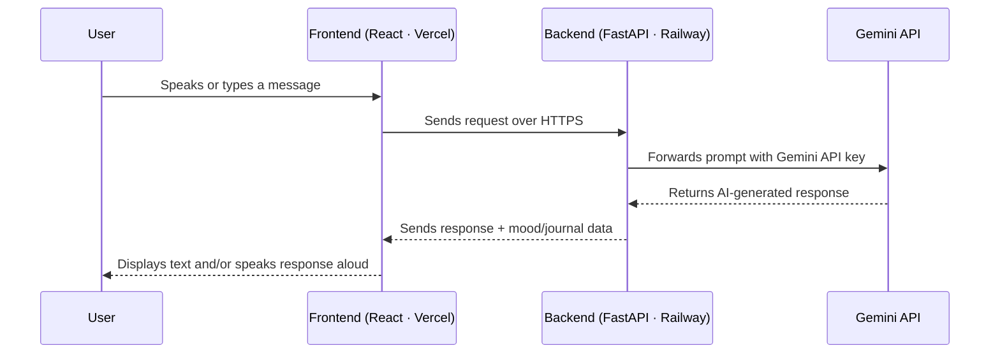

<div align="center">

# 🧠 MindSphere

### An AI companion that actually listens — by text, or by voice.


<br/>

[](https://mindsphere.fit)
[](https://mindsphere.fit)
[](https://railway.app)
[](https://ai.google.dev)
[](https://fastapi.tiangolo.com/)
[](https://react.dev)
[](LICENSE)

**[🚀 Try it live →](https://mindsphere.fit)**

</div>

<br/>

## 📌 The Problem

1 in 5 people struggle with their mental health at some point every year — yet most never talk about it. The barriers aren't a lack of care, they're **friction**: booking a therapist feels heavy, journaling apps feel like homework, and generic chatbots feel robotic and forgettable.

There's no space that's *instant, private, and human-feeling enough* for someone to just say "hey, today was rough" — and actually be heard.

## 💡 The Solution

**MindSphere** is an AI-powered mental wellness companion that removes that friction entirely. Open the app, and you can:

- **Talk out loud** to an empathetic AI in real time — no typing required
- **Journal** your thoughts with AI-guided prompts that go deeper than "Dear Diary"
- **Track your mood** over time and actually *see* your emotional patterns
- Get **conversational support** that remembers context and responds like it understands you — not like it's reading a script

No appointments. No stigma. No blank page staring back at you. Just a companion that's there the moment you need to talk.

<br/>

## 🎥 Demo

<div align="center">

**🔗 Live App:** [**mindsphere.fit**](https://mindsphere.fit)

*(Add a demo GIF or screen recording here — this is the single highest-impact thing you can add before judging. A 20–30s clip of Voice Mode in action sells the project instantly.)*

</div>

<br/>

## ✨ Core Features

| | Feature | Description |
|---|---|---|
| 🎙️ | **Voice Mode** | Speak naturally and get real-time spoken responses back — powered end-to-end by the **Gemini API**, no third-party speech vendor needed |
| 💬 | **AI Chat Support** | Context-aware, empathetic conversation that adapts to how you're feeling in the moment |
| 📓 | **Smart Journaling** | AI-guided prompts that turn a blank page into genuine reflection |
| 📊 | **Mood Tracking** | Log your mood daily and visualize trends over time |
| 🔒 | **Privacy First** | Your conversations and entries stay yours |
| 📱 | **Responsive by Design** | A calm, distraction-free UI that works on any device |

<br/>

## 🏗️ Tech Stack

<div align="center">

| Layer | Technology | Hosted On |
|---|---|---|
| **Frontend** | React (JavaScript) | ▲ **Vercel** |
| **Backend / API** | Python · **FastAPI** | 🚂 **Railway** |
| **Voice Intelligence** | **Gemini API** (speech understanding + conversational response, single API key) | Google AI |
| **Conversational AI** | Gemini API (chat, journaling prompts, mood-aware responses) | Google AI |

</div>

<br/>

## 🧭 How It Works



**Voice Mode, specifically:** the browser captures the user's speech → audio/text is sent to the FastAPI backend → the backend calls the **Gemini API** for both understanding and generating a natural response → the reply is streamed back and spoken aloud to the user. One API key, start to finish — no separate STT/TTS vendors stitched together.

<br/>

## ⚙️ Getting Started

### Prerequisites
- Node.js v18+
- Python 3.10+
- A [Gemini API key](https://ai.google.dev)

### 1. Clone the repo
```bash
git clone https://github.com/Abhiraj-tech-7/MindSphere.git
cd MindSphere
```

### 2. Backend (FastAPI)
```bash
cd backend
pip install -r requirements.txt

echo "GEMINI_API_KEY=your_gemini_api_key_here" > .env

uvicorn server:app --reload
```

### 3. Frontend (React)
```bash
cd frontend
npm install

echo "REACT_APP_BACKEND_URL=http://localhost:8000" > .env

npm start
```

App runs locally at `http://localhost:3000` 🎉

### Environment Variables

| Variable | Where | Purpose |
|---|---|---|
| `GEMINI_API_KEY` | Backend | Powers all AI chat + voice mode responses |
| `REACT_APP_BACKEND_URL` | Frontend | Points the UI to the FastAPI backend |

<br/>

## 🌐 Deployment

| Component | Platform | 
|---|---|
| Frontend | [Vercel](https://vercel.com) |
| Backend | [Railway](https://railway.app) |
| **Live at** | **[mindsphere.fit](https://mindsphere.fit)** |

<br/>

## 🚧 Challenges We Ran Into

- Getting **low-latency, natural-sounding** voice conversation working end-to-end on a single Gemini API key, without the round-trip feeling laggy or robotic
- Designing conversational prompts so the AI responds with genuine empathy instead of generic chatbot filler
- Keeping the backend on Railway and frontend on Vercel talking smoothly across CORS/networking during deployment

## 📚 What We Learned

- How to architect a real-time voice pipeline around a single multimodal API instead of stitching together separate STT/TTS services
- Prompt design specifically for emotionally sensitive, mental-health-adjacent conversations
- Shipping a full-stack app (React + FastAPI) across two separate hosting platforms with a clean CI/CD flow

<br/>

## 🔮 What's Next

- [ ] Personalized weekly mood insights & summaries
- [ ] Multi-language voice mode
- [ ] Guided breathing / mindfulness sessions inside the app
- [ ] Optional crisis-resource surfacing for users who need more support than an AI can give
- [ ] Native mobile app

<br/>

## 👥 Team

<div align="center">

| | Name | Focus |
|---|---|---|
| 🧑‍💻 | **Abhiraj Balyan** | Backend, AI/Voice Integration, Deployment |
| 🧑‍💻 | **Vaibhav Punia** | Frontend, UI/UX, Product Design |

</div>

<br/>

## ⚠️ A Note on Scope

MindSphere is a supportive companion, not a replacement for professional mental health care. If you or someone you know is in crisis, please reach out to a licensed professional or a local crisis helpline.

<br/>

## 📄 License

Released under the [MIT License](LICENSE).

---

<div align="center">

**MindSphere** — because your mind deserves a space of its own. 🌌

[Live App](https://mindsphere.fit) · [Issues](https://github.com/Abhiraj-tech-7/MindSphere/issues) · [Team](#-team)

</div>
